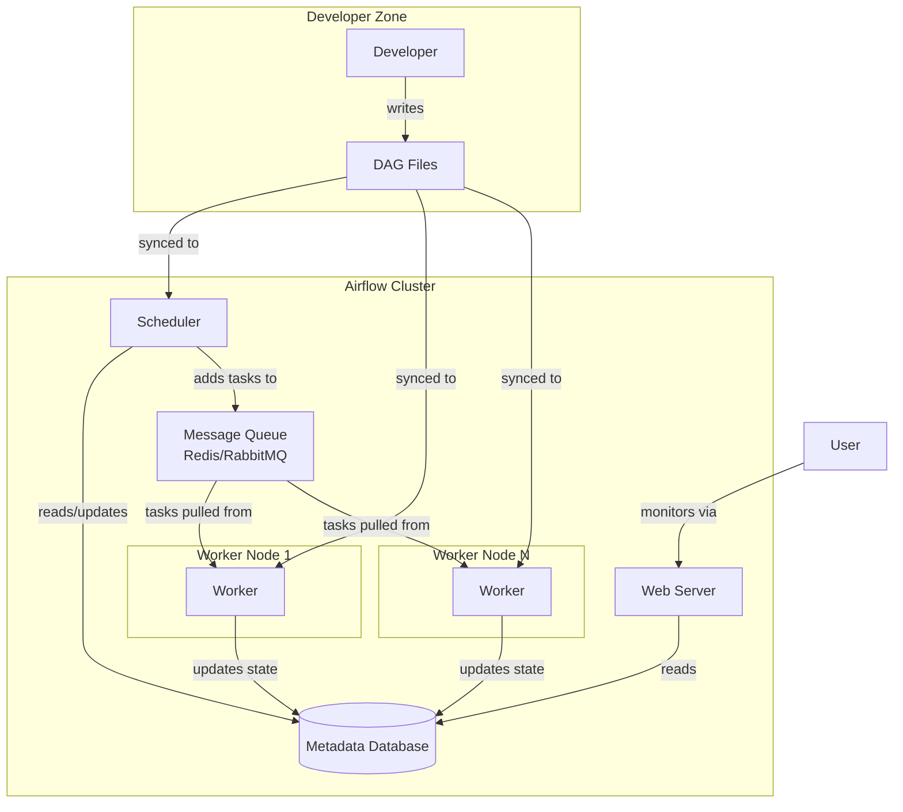

------

# 🌐 Apache Airflow Architecture (Detailed Explanation)

Airflow is built on a **distributed architecture** designed to schedule, orchestrate, and monitor workflows. It follows a **modular design** with loosely coupled components that communicate mainly through a **metadata database** and a **message queue** (for tasks execution).

------

## 🔑 Core Components of Airflow

### 1. **Scheduler**

- The **brain** of Airflow.
- Responsible for:
  - Parsing **DAG files**.
  - Deciding which tasks need to run and when (based on scheduling interval, dependencies, triggers).
  - Pushing task execution requests into the **Executor/Message Queue**.
- Runs continuously, monitoring all DAGs and their states.
- **Key point**: It doesn’t execute tasks itself, just schedules them.

------

### 2. **Executor**

- Responsible for **running tasks**.
- Works with the **Scheduler**:
  - Scheduler decides "what to run".
  - Executor decides "how to run".
- Types of executors:
  - **SequentialExecutor** → Runs tasks one by one (good for testing).
  - **LocalExecutor** → Runs tasks in parallel locally (using multiprocessing).
  - **CeleryExecutor** → Distributes tasks across worker nodes using **Celery + message broker** (RabbitMQ/Redis).
  - **KubernetesExecutor** → Spins up a pod per task on Kubernetes.

------

### 3. **Workers**

- Actual **task executors**.
- Pick tasks from the **queue** and run them.
- Type of workers depends on executor:
  - With **CeleryExecutor**, tasks are pulled by Celery workers.
  - With **KubernetesExecutor**, tasks run inside pods.
- Each worker executes the Python code (or operator logic) defined in a task.

------

### 4. **Webserver (UI)**

- A **Flask-based web app**.
- Provides an interactive **UI for monitoring and managing workflows**:
  - View DAGs and their structure.
  - Trigger DAGs manually.
  - Monitor task states (success, failed, queued).
  - Retry failed tasks.
- Connects to the **metadata database** to fetch DAG/task state.

------

### 5. **Metadata Database**

- A **central relational database** (commonly PostgreSQL or MySQL).
- Stores:
  - DAG definitions.
  - Task states (success, failed, queued, running).
  - Scheduler metadata (execution times, logs, dependencies).
  - User information & connections.
- Every component (Scheduler, Webserver, Workers) reads/writes from this DB.

------

### 6. **Message Queue (only for distributed executors)**

- Used for **communication between Scheduler and Workers**.
- Example:
  - Scheduler places a task in the queue.
  - Worker picks it up, executes it, and updates the database.
- Backends:
  - Redis
  - RabbitMQ
  - (Not needed for SequentialExecutor / LocalExecutor).

------

### 7. **DAG Directory (Code Repository)**

- All DAGs are just **Python scripts** stored in the DAGs folder.
- Scheduler continuously scans this directory for changes.
- Best practice: Store DAGs in **Git** and deploy them to Airflow.

------

### 8. **Plugins / Operators / Hooks**

- Extend Airflow capabilities.
- **Operators**: Define specific tasks (e.g., `PythonOperator`, `BashOperator`, `PostgresOperator`).
- **Hooks**: Interfaces for external systems (e.g., AWS, GCP, MySQL).
- **Plugins**: Custom extensions to Airflow.

------

## ⚙️ How Airflow Works (Flow of Execution)

1. **DAG Definition**
   - User writes a DAG (Directed Acyclic Graph) in Python.
   - Saved in DAGs folder.
2. **Scheduler Scans DAGs**
   - Scheduler loads DAG definition.
   - Decides when tasks should run based on schedule and dependencies.
3. **Scheduler Puts Tasks in Queue**
   - Tasks marked as "ready to run" are placed in the message queue (Celery/Kubernetes).
4. **Workers Pick Tasks**
   - Workers fetch tasks from queue.
   - Execute them (e.g., run Python code, SQL queries, API calls).
5. **Task State Updated in Metadata DB**
   - Worker updates result (success/failure) in DB.
   - Webserver reads from DB to update UI.

------

## 🔄 Airflow Execution Model

- **Pull-based model**:
  - Workers **pull tasks** from queue.
- **Stateful system**:
  - All states are persisted in the metadata DB.
- **Decoupled**:
  - Scheduler doesn’t care about execution → only schedules.
  - Workers only execute → don’t decide what to run.

------

## 🏗️ Typical Airflow Deployment

- **Single Machine (LocalExecutor/SequentialExecutor)**:
  - Scheduler + Webserver + Metadata DB + Worker run on one node.
  - Good for testing/development.
- **Distributed Cluster (Celery/KubernetesExecutor)**:
  - Scheduler on one node.
  - Webserver on one node.
  - Metadata DB on a dedicated server (Postgres/MySQL).
  - Workers across multiple nodes (scalable).
  - Message broker (Redis/RabbitMQ).

------

## 📊 Diagram of Airflow Architecture (Text Representation)

```
          +------------------+
          |   Webserver UI   |
          +--------+---------+
                   |
                   v
          +------------------+
          |  Metadata DB     |
          | (Postgres/MySQL) |
          +--------+---------+
                   ^
                   |
          +------------------+      +------------------+
          |   Scheduler      | ---> |   Message Queue  |
          +------------------+      +------------------+
                                             |
                                      +------+------+
                                      |   Workers   |
                                      +-------------+
```

------

✅ **Summary**:
 Airflow is built on a **modular, distributed architecture** where:

- **Scheduler** = decides what to run.
- **Executor/Workers** = run tasks.
- **Metadata DB** = stores states.
- **Webserver** = monitoring UI.
- **Message Queue** = enables distributed execution.

------

##  Review:

### What is Apache Airflow?

Before diving into the architecture, it's crucial to understand what Airflow is. Apache Airflow is an open-source platform used to **programmatically author, schedule, and monitor workflows**. Workflows are defined as Directed Acyclic Graphs (DAGs) of tasks, meaning the tasks have dependencies and a clear flow direction, with no loops.

The key principle is "**Workflows as Code**." Instead of clicking buttons in a UI to define dependencies, you write Python code. This makes workflows maintainable, versionable, testable, and collaborative.

---

### Core Components of Airflow Architecture

Airflow follows a modular, multi-component architecture that is typically distributed across multiple machines. The main components are:

1.  **Scheduler**
2.  **Web Server**
3.  **Executor**
4.  **Workers**
5.  **Metadata Database**
6.  **DAG Directory**

Let's break down each component in detail.

#### 1. The Scheduler
The **Scheduler** is the brain of the entire Airflow operation. It is a persistent service that does the following:

*   **DAG Parsing:** It periodically (every few seconds, configurable) scans the DAG directory for new Python files, parses them, and updates the metadata database with any changes (new DAGs, new tasks, etc.).
*   **Task Scheduling:** It examines all DAGs and their tasks, checks their dependencies (`upstream`, `downstream`), and determines which tasks are ready to be executed based on their schedule interval and dependencies.
*   **Triggering Tasks:** Once a task is deemed ready, the Scheduler creates a `TaskInstance` object in the metadata database, representing a specific run of that task, and places it in the execution queue.
*   **Orchestration:** It manages the state of all tasks (e.g., queued, running, success, failed, skipped) and triggers downstream tasks when their dependencies are met.

**How it works:** The Scheduler is a multi-threaded process. It uses one thread to parse DAGs and another to schedule tasks. Its performance is critical for the entire system. If the Scheduler goes down, no new tasks are scheduled.

#### 2. The Web Server
The **Web Server** is the user interface (UI) of Airflow. It is a Flask application that provides a real-time dashboard to:

*   **Visualize DAGs:** See the graph view, tree view, timeline, and other visual representations of your pipelines.
*   **Monitor & Troubleshoot:** Check the status of past and current DAG and task runs.
*   **Manage:** Manually trigger DAG runs, clear task states, pause/unpause DAGs, configure Variables and Connections.
*   **View Logs:** Access the logs for each task instance, which is invaluable for debugging failures.

The Web Server is a passive component; it doesn't run any tasks itself. It simply reads and presents the state information stored in the metadata database.

#### 3. The Executor
The **Executor** is the mechanism *how* tasks get run. It is the bridge between the Scheduler and the Workers. The Scheduler decides *what* to run, and the Executor decides *where* and *how* it gets run.

There are several types of Executors, and choosing the right one is a key architectural decision:

*   **SequentialExecutor:** The default. Runs one task at a time on the same machine as the Scheduler. Useful only for development and testing. **Cannot run tasks in parallel.**
*   **LocalExecutor:** Runs tasks as subprocesses on the same machine as the Scheduler. Allows for parallelism (multi-core) but is still limited to a single machine. Good for small-scale production setups.
*   **CeleryExecutor:** The classic distributed executor. It uses a **Celery backend** (like Redis or RabbitMQ) as a message queue/broker. The Scheduler adds tasks to the queue, and any number of **Celery Workers** (on different machines) can pick up tasks from the queue and execute them. This is the standard way to achieve a highly scalable, distributed Airflow cluster.
*   **KubernetesExecutor:** The modern, cloud-native executor. Instead of static workers, it dynamically launches a new Kubernetes Pod for *each task*. This provides incredible isolation, resource efficiency, and scalability. When the task finishes, the pod is destroyed. It's more complex to set up but offers the best resource management.

#### 4. The Workers
**Workers** are the processes or machines that actually **execute the tasks** (e.g., run a Python function, execute a Bash command, call an API).

*   Their role depends on the chosen Executor:
    *   **CeleryExecutor:** Workers are long-running `airflow celery worker` processes on one or more machines, waiting for messages from the message queue.
    *   **KubernetesExecutor:** The "worker" is a temporary, dynamically created Kubernetes Pod.
    *   **LocalExecutor/SequentialExecutor:** The "worker" is just a subprocess on the Scheduler's machine.

#### 5. The Metadata Database
This is the **central source of truth** for the entire Airflow system. It's a relational database (commonly PostgreSQL, MySQL, or SQLite for development) that stores:

*   The state of all DAGs, DAG runs, task instances, and their histories (success, failure, etc.).
*   Airflow configuration (Variables, Connections, Pools).
*   User information and roles.
*   The history of all actions taken via the UI or CLI.

Every component (Scheduler, Web Server, Workers) interacts with this database to read and write state information. Its performance is critical; a slow database can bring the entire Airflow cluster to a halt.

#### 6. The DAG Directory
This is a simple directory on the filesystem (e.g., `~/airflow/dags`) where all your DAG Python files (.py) are placed.

*   The Scheduler and Workers **must have access to this same directory**.
*   In a distributed setup, this often means using a shared network filesystem (e.g., NFS, EFS, Azure Files) or distributing the files via a CI/CD pipeline (e.g., syncing to an S3 bucket and having a sidecar container sync them to a local volume in Kubernetes).

---

### How the Components Interact: A Task's Journey

Here is the step-by-step lifecycle of a single task execution:

1.  **Authoring:** A developer writes a `my_dag.py` file and places it in the shared DAG directory.
2.  **Discovery:** The Scheduler parses `my_dag.py`, identifies the DAG and its tasks, and saves this structure to the metadata database.
3.  **Scheduling:** Based on the DAG's schedule (`@daily`), the Scheduler creates a `DagRun` entry in the database. It then evaluates the tasks within that DagRun. For a task whose dependencies are met (e.g., its start time has passed and upstream tasks are successful), the Scheduler creates a `TaskInstance` with state `scheduled`.
4.  **Queuing:** The Scheduler, with the help of the configured **Executor**, changes the `TaskInstance` state to `queued` and places it in the execution queue (e.g., a Celery queue in Redis).
5.  **Execution:** An idle **Worker** picks up the task from the queue.
    *   For **CeleryExecutor**, a Celery worker process sees the message.
    *   For **KubernetesExecutor**, the executor instructs the Kubernetes API to create a new Pod.
    The Worker changes the task state to `running` in the database.
6.  **Processing:** The Worker executes the task's logic (e.g., runs the Python operator's function).
7.  **Completion:** The task finishes.
    *   On **success**, the Worker updates the `TaskInstance` state to `success`.
    *   On **failure**, it updates the state to `failed` and records the error.
8.  **Propagation:** The Scheduler, which is constantly monitoring the database, sees the state change. It then checks if any downstream tasks now have their dependencies met and can be scheduled, restarting the process from step 3 for the next task.
9.  **Visualization:** Throughout this process, the **Web Server** is continuously reading the state from the metadata database. The user can see the task progress change from "queued" to "running" to "success" in the UI in near real-time.

### Visualizing the Architecture

Here is a diagram illustrating the flow of information in a **CeleryExecutor** setup, the most common distributed architecture:



### Key Architectural Concepts

*   **Scalability:** Achieved horizontally by adding more Worker nodes (CeleryExecutor) or letting Kubernetes handle it (KubernetesExecutor).
*   **High Availability (HA):** For production, critical components like the Scheduler, Web Server, and database can be deployed in a HA setup (e.g., multiple Scheduler instances, database replicas).
*   **Isolation:** The KubernetesExecutor provides the best task isolation, as each task runs in its own pod. With CeleryExecutor, tasks are isolated by process.
*   **Single Point of Failure (SPOF):** The Metadata Database is the primary SPOF. If it goes down, the entire system halts. Therefore, it must be robust and highly available.

### Summary Table

| Component         | Role                | Key Responsibility                                           |
| :---------------- | :------------------ | :----------------------------------------------------------- |
| **Scheduler**     | The Brain           | Parses DAGs, schedules tasks, triggers downstream tasks.     |
| **Web Server**    | The UI              | Provides a dashboard to visualize, monitor, and manage DAGs and tasks. |
| **Executor**      | The Mechanic        | Defines *how* and *where* tasks are executed (e.g., Local, Celery, K8s). |
| **Workers**       | The Muscle          | The processes/nodes that actually execute the task logic.    |
| **Metadata DB**   | The Source of Truth | Central database storing all state, configuration, and history. |
| **DAG Directory** | The Library         | Shared location where all DAG code is stored.                |