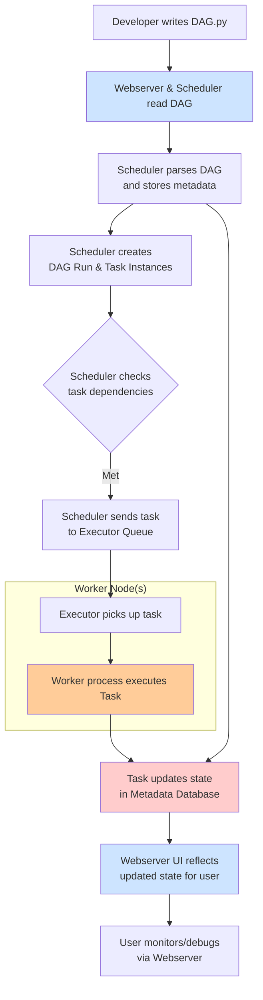

# Important Note on "Airflow 3.0"

As of my last update (mid-2024), a formal, final "Airflow 3.0" release does not yet exist. The community is actively developing it, and many of the features discussed here are based on the **Airflow 3.0 Proposal (AIP-52)** and ongoing work on the `main` branch.

The core components remain largely the same, but Airflow 3.0 aims to refine them significantly, focusing on **simplicity, performance, and a more intuitive user experience**. Key themes for 3.0 include the removal of legacy components and a stronger emphasis on the TaskFlow API.

---

### 1. The Scheduler
**The brain of Airflow.**

*   **Purpose:** The Scheduler is a persistent daemon that is responsible for triggering scheduled workflows, submitting Tasks to the executor to be run, and managing the overall state of all DAGs and their associated Task instances.
*   **How it Works (Enhanced in 3.0):**
    1.  **Parses DAGs:** Continuously reads your DAG files to understand the schedule and structure.
    2.  **Checks Schedule:** Based on the DAG's `schedule_interval`, it determines if a DAG Run should be created.
    3.  **Creates DAG Run:** Instantiates a DAG Run object for a specific logical date and time.
    4.  **Evaluates Task States:** For each task in the DAG, it checks dependencies (upstream/downstream, past success, etc.).
    5.  **Queues Eligible Tasks:** Tasks whose dependencies are met are sent to the **Executor** to be queued for execution.
*   **Airflow 3.0 Impact:** The scheduler continues to see performance optimizations. The introduction of **HA Schedulers** (High Availability) is a major goal, allowing multiple scheduler instances to run concurrently for fault tolerance, a feature that has been evolving and is maturing towards 3.0.

### 2. The Executor
**The muscle of Airflow. It executes the tasks.**

The Executor is the mechanism that gets tasks *done*. Airflow provides several executors, which you configure in `airflow.cfg`.

*   **SequentialExecutor:** The default. Runs one task at a time. Good for debugging only. Not for production.
*   **LocalExecutor:** Runs tasks as subprocesses on the same machine as the scheduler. Good for small-scale production setups.
*   **CeleryExecutor:** The classic distributed executor. Uses a **Celery** worker pool with a message queue (like Redis or RabbitMQ) to distribute tasks across multiple worker machines. Ideal for medium-to-large scale production.
*   **KubernetesExecutor:** Dynamically launches a separate Kubernetes Pod for *each task*. Highly resilient, resource-efficient, and perfect for a cloud-native environment. It leverages the Kubernetes API.
*   **CeleryKubernetesExecutor:** A hybrid executor that allows you to specify on a per-task basis whether it should run in the Celery pool or in a dynamically created Kubernetes Pod.
*   **Airflow 3.0 Impact:** The `KubernetesExecutor` is a first-class citizen and is heavily promoted for its scalability and isolation benefits, aligning with modern infrastructure trends.

### 3. The Webserver
**The face of Airflow.**

*   **Purpose:** A Flask web application that provides a rich UI to monitor, manage, and troubleshoot your DAGs and tasks.
*   **Key UI Features:**
    *   **DAGs View:** Overview of all DAGs, their states, and schedule.
    *   **Graph View:** Visual representation of the DAG's tasks and dependencies.
    *   **Tree View:** A historical view of task instances across multiple DAG runs.
    *   **Grid View (New in Airflow 2.3+):** A powerful replacement for the Tree View, offering a better overview of historical runs and task statuses in a grid layout. This is the modern standard.
    *   **Code View:** Allows you to view the Python source code of the DAG.
    *   **Task Duration & Gantt Charts:** For performance analysis.
*   **Airflow 3.0 Impact:** The UI is constantly being improved. The legacy **Tree View is being deprecated and replaced by the superior Grid View**. The overall UX is being streamlined.

### 4. The Metadata Database
**The heart and long-term memory of Airflow.**

*   **Purpose:** A central SQL database that stores all state and metadata. This includes:
    *   DAG definitions (but not the code itself)
    *   DAG Run and Task Instance histories, states, and logs
    *   Variables, Connections, Pools, and other configuration
    *   User and permission data (if using RBAC)
*   **Supported Databases:** PostgreSQL (recommended for production), MySQL, SQLite (for development only), MSSQL.
*   **Airflow 3.0 Impact:** The database schema continues to evolve. There is a strong focus on **database performance**, especially for large-scale deployments, with optimizations for query patterns and indexing.

### 5. DAGs (Directed Acyclic Graphs)
**The workflow definitions.**

*   **Purpose:** A DAG is a collection of all the tasks you want to run, organized to reflect their relationships and dependencies. It is defined as a Python script.
*   **Key Concepts:**
    *   **Directed:** Tasks have a clear direction (upstream -> downstream).
    *   **Acyclic:** Tasks cannot loop back to create a cycle; the graph must flow in one direction.
    *   **DAG Run:** An instantiation of a DAG for a specific execution date.
*   **Airflow 3.0 Impact:** The **TaskFlow API** (introduced in Airflow 2.0) is now the **primary and recommended way** to define tasks and dependencies. It simplifies DAG authoring by using Python decorators and automatically handles XComs.

    **Example: Traditional vs. TaskFlow API**
    ```python
    # Traditional (Operator-based)
    from airflow.operators.python import PythonOperator
    
    def extract():
        return data
    
    extract_task = PythonOperator(
        task_id='extract',
        python_callable=extract
    )
    
    # TaskFlow API (Modern, preferred in Airflow 3)
    from airflow.decorators import task, dag
    
    @dag()
    def my_dag():
        @task()
        def extract():
            return data
        
        extract_result = extract()
    ```

### 6. Operators
**The templates for your tasks.**

*   **Purpose:** Operators determine *what* actually gets done by a task. Each task is an instance of an operator.
*   **Types:**
    *   **Action Operators:** Perform an action (e.g., `PythonOperator`, `BashOperator`, `HttpOperator`).
    *   **Transfer Operators:** Move data from one place to another (e.g., `S3ToRedshiftOperator`).
    *   **Sensor Operators:** Wait for a certain condition or time to be met (e.g., `S3KeySensor`, `ExternalTaskSensor`). They poke until true.
*   **Airflow 3.0 Impact:** The ecosystem of providers (separately installable packages for tools like AWS, GCP, Snowflake, etc.) continues to grow. Airflow 3.0 core will likely ship with a minimal set of operators, pushing most to the provider packages for better maintainability.

### 7. Tasks & Task Instances
**The units of work.**

*   **Task:** A defined unit of work within a DAG (e.g., `run_this_task = BashOperator(...)`). It's a representation of what should be done.
*   **Task Instance:** A specific run of a task for a given DAG Run and execution date. It represents a concrete occurrence with a state (e.g., `success`, `failed`, `running`, `up_for_retry`).

### 8. Workers
**The compute power.**

*   **Purpose:** The nodes that actually execute the tasks. This is only relevant for distributed executors like `CeleryExecutor` or `KubernetesExecutor`.
*   **How it Works:** The Scheduler places tasks in a queue. Workers are processes (or pods) that continuously poll this queue, pick up tasks, execute them, and report the result back to the metadata database.

### 9. XComs (Cross-Communication)
**How tasks talk to each other.**

*   **Purpose:** A mechanism that allows tasks to exchange small amounts of data (e.g., a filename, a data point, a model parameter). The data is stored in the Metadata Database.
*   **Airflow 3.0 Impact:** The TaskFlow API **automatically handles XComs** for you when you return a value from a `@task` decorated function, making their use much more intuitive and less error-prone.

### 10. Hooks
**The connections to external systems.**

*   **Purpose:** Hooks provide a reusable interface to interact with external platforms and databases (e.g., MySQLHook, S3Hook, SlackHook). They abstract the API complexities and often handle connection management. Operators often use Hooks under the hood.

### Component Interaction Diagram

The following diagram illustrates how these core components work together:



### Summary of Airflow 3.0 Focus

*   **TaskFlow API First:** The decorator-based API is the standard.
*   **Modern UI:** Grid View is central; legacy views are phased out.
*   **Production Resilience:** Enhanced Scheduler HA and database performance.
*   **Kubernetes-Native:** Strong support for `KubernetesExecutor` and dynamic task execution.
*   **Clean Core:** A minimal core with extended functionality provided by independent provider packages.

