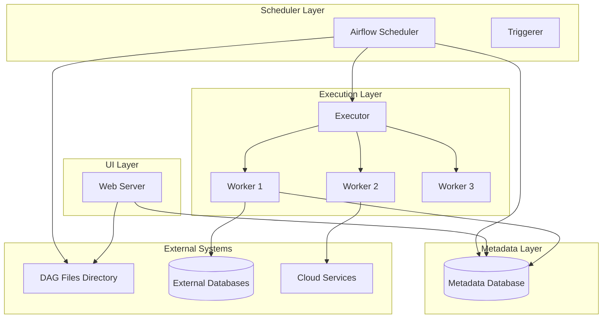

# Apache Airflow Ecosystem: Comprehensive Introduction

## Overview of Apache Airflow

Apache Airflow is an open-source platform designed for programmatically authoring, scheduling, and monitoring workflows. Created by Airbnb in 2014 and later donated to the Apache Software Foundation, Airflow has become the industry standard for workflow orchestration.

## Core Architecture



## Key Components

### 1. Directed Acyclic Graphs (DAGs)
- **Definition**: A DAG is a collection of tasks with directional dependencies
- **Characteristics**: No cycles allowed (tasks can't depend on themselves)
- **Representation**: Defined as Python code

### 2. Tasks
- **Operators**: Predefined templates for common tasks (Bash, Python, Email, etc.)
- **Sensors**: Special operators that wait for a condition to be met
- **TaskFlow API**: Simplified way to define tasks with dependencies

### 3. Executors
- **SequentialExecutor**: Default executor (for development only)
- **LocalExecutor**: Runs tasks in parallel on a single machine
- **CeleryExecutor**: Distributed task execution using Celery
- **KubernetesExecutor**: Runs each task in a separate Kubernetes pod

### 4. Scheduler
- Parses DAGs and schedules tasks
- Monitors task execution and triggers dependencies
- Handles retries and failures

### 5. Web Server
- Flask-based UI for monitoring and managing workflows
- Provides views for DAGs, tasks, execution history, and logs

## Ecosystem Components

### Core Integrations
1. **Providers Packages**: Modular packages for integrating with external systems
2. **Hooks**: Interfaces to external platforms and databases
3. **Connections**: Secure storage for authentication credentials

### Key Provider Packages
- Amazon AWS
- Google Cloud Platform
- Microsoft Azure
- Snowflake
- PostgreSQL/MySQL
- Docker
- Kubernetes
- Slack
- Databricks

### Monitoring & Logging
- Integration with StatsD for metrics
- Support for multiple logging backends
- Alerting through various channels (email, Slack, PagerDuty)

## Airflow 3.0 Enhancements

### New Features
1. **TaskFlow API Improvements**: Enhanced decorator-based DAG definition
2. **Smarter Scheduler**: Performance optimizations for large-scale deployments
3. **UI/UX Enhancements**: Modernized interface with better usability
4. **Stronger Security**: Improved authentication and authorization mechanisms
5. **Database Support**: Expanded support for additional database backends

### Performance Optimizations
- Faster DAG parsing
- Improved scheduler performance
- Reduced database contention
- Better handling of large numbers of DAGs and tasks

## Typical Use Cases

1. **ETL Pipelines**: Extract, Transform, Load processes
2. **Data Engineering**: Data processing and transformation workflows
3. **Machine Learning**: Model training and deployment pipelines
4. **Infrastructure Management**: Cloud resource provisioning and management
5. **Business Intelligence**: Automated report generation and distribution

## Deployment Options

1. **Standalone**: Single machine setup (development only)
2. **Docker Compose**: Local development with containers
3. **Kubernetes**: Production-grade container orchestration
4. **Managed Services**: 
   - Astronomer
   - Google Cloud Composer
   - Amazon MWAA (Managed Workflows for Apache Airflow)

## Getting Started

### Basic Installation
```bash
# Using pip
pip install "apache-airflow==3.0.0"

# Using constraints file (recommended)
pip install "apache-airflow==3.0.0" \
 --constraint "https://raw.githubusercontent.com/apache/airflow/constraints-3.0.0/constraints-3.10.txt"
```

### Initial Setup
```bash
# Initialize database
airflow db init

# Create admin user
airflow users create \
    --username admin \
    --firstname FirstName \
    --lastname LastName \
    --role Admin \
    --email admin@example.com

# Start services
airflow webserver --port 8080
airflow scheduler
```

## Sample DAG Structure

```python
from airflow import DAG
from airflow.operators.python import PythonOperator
from datetime import datetime, timedelta

def extract_data():
    # Data extraction logic
    return data

def transform_data(**context):
    # Data transformation logic
    ti = context['ti']
    data = ti.xcom_pull(task_ids='extract_task')
    return transformed_data

def load_data(**context):
    # Data loading logic
    ti = context['ti']
    transformed_data = ti.xcom_pull(task_ids='transform_task')

default_args = {
    'owner': 'airflow',
    'depends_on_past': False,
    'email_on_failure': True,
    'email_on_retry': False,
    'retries': 1,
    'retry_delay': timedelta(minutes=5),
}

with DAG(
    'etl_pipeline',
    default_args=default_args,
    description='A simple ETL pipeline',
    schedule_interval=timedelta(days=1),
    start_date=datetime(2023, 1, 1),
    catchup=False,
) as dag:

    extract_task = PythonOperator(
        task_id='extract_task',
        python_callable=extract_data,
    )

    transform_task = PythonOperator(
        task_id='transform_task',
        python_callable=transform_data,
    )

    load_task = PythonOperator(
        task_id='load_task',
        python_callable=load_data,
    )

    extract_task >> transform_task >> load_task
```

## Learning Path Recommendations

1. **Beginner**: Understand core concepts (DAGs, Operators, Tasks)
2. **Intermediate**: Explore hooks, connections, and XComs
3. **Advanced**: Master custom operators, plugins, and executor configurations
4. **Expert**: Dive into Kubernetes deployment and scaling strategies

## Community and Resources

- **Official Documentation**: https://airflow.apache.org/
- **GitHub Repository**: https://github.com/apache/airflow
- **Slack Channel**: Apache Airflow Slack workspace
- **Stack Overflow**: Active community support
- **Conferences**: Airflow Summit and various meetups

 