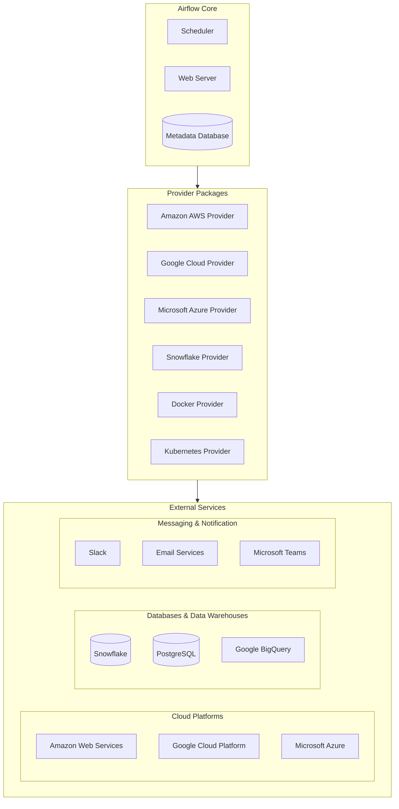

# Integrations

# Apache Airflow Integrations: Complete Professional Guide

## Overview of Airflow Integration Ecosystem

Apache Airflow's power comes from its extensive integration capabilities with virtually every modern data processing and infrastructure tool. The integration system is built around **Providers** - modular packages that contain operators, hooks, sensors, and transfers for specific services.

## Integration Architecture



## Core Integration Concepts

### 1. Providers Packages
Modular Python packages that extend Airflow's functionality:
```python
# Installation example
pip install apache-airflow-providers-amazon
pip install apache-airflow-providers-google
pip install apache-airflow-providers-snowflake
```

### 2. Hooks
Interfaces to external platforms that abstract API interactions:
```python
from airflow.providers.amazon.aws.hooks.s3 import S3Hook
from airflow.providers.snowflake.hooks.snowflake import SnowflakeHook

# Create hooks
s3_hook = S3Hook(aws_conn_id='aws_default')
snowflake_hook = SnowflakeHook(snowflake_conn_id='snowflake_conn')
```

### 3. Operators
Reusable task templates for common operations:
```python
from airflow.providers.amazon.aws.operators.s3 import S3CopyObjectOperator
from airflow.providers.snowflake.operators.snowflake import SnowflakeOperator
```

### 4. Sensors
Special operators that wait for certain conditions:
```python
from airflow.providers.amazon.aws.sensors.s3 import S3KeySensor
from airflow.providers.http.sensors.http import HttpSensor
```

### 5. Transfers
Operators for moving data between systems:
```python
from airflow.providers.amazon.aws.transfers.s3_to_redshift import S3ToRedshiftOperator
from airflow.providers.google.cloud.transfers.gcs_to_bigquery import GCSToBigQueryOperator
```

## Major Integration Categories

### Cloud Platform Integrations

#### Amazon Web Services (AWS)
```python
# AWS Operators and Hooks
from airflow.providers.amazon.aws.operators.ecs import ECSOperator
from airflow.providers.amazon.aws.operators.lambda_function import LambdaInvokeFunctionOperator
from airflow.providers.amazon.aws.hooks.redshift import RedshiftHook
from airflow.providers.amazon.aws.sensors.s3 import S3KeySensor

# Example: S3 to Redshift ETL
s3_to_redshift = S3ToRedshiftOperator(
    task_id='s3_to_redshift',
    schema='my_schema',
    table='my_table',
    s3_bucket='my-bucket',
    s3_key='data/file.csv',
    copy_options=['CSV', 'IGNOREHEADER 1'],
    aws_conn_id='aws_default',
    redshift_conn_id='redshift_default'
)
```

#### Google Cloud Platform (GCP)
```python
# GCP Operators and Hooks
from airflow.providers.google.cloud.operators.bigquery import BigQueryExecuteQueryOperator
from airflow.providers.google.cloud.operators.dataflow import DataflowTemplatedJobStartOperator
from airflow.providers.google.cloud.hooks.gcs import GCSHook
from airflow.providers.google.cloud.sensors.gcs import GCSObjectExistenceSensor

# Example: BigQuery Query Execution
bq_query = BigQueryExecuteQueryOperator(
    task_id='bq_query',
    sql='SELECT * FROM `my_project.my_dataset.my_table`',
    destination_dataset_table='my_project.my_dataset.results_table',
    write_disposition='WRITE_TRUNCATE',
    gcp_conn_id='google_cloud_default'
)
```

#### Microsoft Azure
```python
# Azure Operators and Hooks
from airflow.providers.microsoft.azure.operators.data_factory import AzureDataFactoryRunPipelineOperator
from airflow.providers.microsoft.azure.hooks.wasb import WasbHook
from airflow.providers.microsoft.azure.sensors.wasb import WasbBlobSensor

# Example: Azure Data Factory Pipeline
adf_pipeline = AzureDataFactoryRunPipelineOperator(
    task_id='adf_pipeline',
    pipeline_name='my_data_pipeline',
    azure_data_factory_conn_id='azure_default',
    resource_group_name='my-resource-group',
    factory_name='my-factory'
)
```

### Database Integrations

#### Snowflake
```python
# Snowflake Integration
from airflow.providers.snowflake.operators.snowflake import SnowflakeOperator
from airflow.providers.snowflake.hooks.snowflake import SnowflakeHook
from airflow.providers.snowflake.transfers.s3_to_snowflake import S3ToSnowflakeOperator

# Example: Snowflake Query
snowflake_query = SnowflakeOperator(
    task_id='snowflake_query',
    sql='SELECT * FROM MY_TABLE',
    snowflake_conn_id='snowflake_default',
    warehouse='MY_WAREHOUSE',
    database='MY_DATABASE',
    schema='MY_SCHEMA'
)
```

#### PostgreSQL/MySQL
```python
# Database Operators
from airflow.providers.postgres.operators.postgres import PostgresOperator
from airflow.providers.mysql.operators.mysql import MySqlOperator
from airflow.providers.common.sql.operators.sql import SQLExecuteQueryOperator

# Example: PostgreSQL Operation
postgres_task = PostgresOperator(
    task_id='postgres_task',
    sql='INSERT INTO my_table VALUES (1, "example")',
    postgres_conn_id='postgres_default',
    autocommit=True
)
```

### Container & Orchestration Integrations

#### Kubernetes
```python
# Kubernetes Integration
from airflow.providers.cncf.kubernetes.operators.pod import KubernetesPodOperator
from airflow.providers.cncf.kubernetes.operators.job import KubernetesJobOperator

# Example: Kubernetes Pod Operator
k8s_pod = KubernetesPodOperator(
    task_id='k8s_pod',
    namespace='default',
    image='python:3.8-slim',
    cmds=['python', '-c'],
    arguments=['print("Hello from Kubernetes")'],
    name='airflow-pod',
    in_cluster=True,
    cluster_context='my-cluster',
    config_file='/path/to/kubeconfig',
    is_delete_operator_pod=True
)
```

#### Docker
```python
# Docker Operator
from airflow.providers.docker.operators.docker import DockerOperator

docker_task = DockerOperator(
    task_id='docker_task',
    image='python:3.8-slim',
    api_version='auto',
    auto_remove=True,
    command='python -c "print(\"Hello from Docker\")"',
    docker_url='unix://var/run/docker.sock',
    network_mode='bridge'
)
```

### Messaging & Notification Integrations

#### Slack
```python
# Slack Integration
from airflow.providers.slack.operators.slack_webhook import SlackWebhookOperator
from airflow.providers.slack.notifications.slack import send_slack_notification

# Example: Slack Notification
slack_notification = SlackWebhookOperator(
    task_id='slack_notification',
    slack_webhook_conn_id='slack_default',
    message='Task completed successfully!',
    channel='#data-alerts',
    username='airflow-bot'
)

# As task callback
def task_failure_callback(context):
    send_slack_notification(
        conn_id='slack_default',
        text=f'Task {context["task_instance"].task_id} failed!'
    )
```

#### Email
```python
# Email Integration
from airflow.operators.email import EmailOperator

email_alert = EmailOperator(
    task_id='email_alert',
    to='team@example.com',
    subject='Airflow Task Completed',
    html_content='<h1>Task completed successfully</h1>',
    conn_id='smtp_default'
)
```

## Advanced Integration Patterns

### Custom Operator Development
```python
from airflow.models import BaseOperator
from airflow.utils.decorators import apply_defaults
from airflow.providers.http.hooks.http import HttpHook

class CustomAPIOperator(BaseOperator):
    @apply_defaults
    def __init__(self, endpoint, method='GET', *args, **kwargs):
        super().__init__(*args, **kwargs)
        self.endpoint = endpoint
        self.method = method
        
    def execute(self, context):
        hook = HttpHook(method=self.method, http_conn_id='my_api_connection')
        response = hook.run(self.endpoint)
        return response.json()
```

### Dynamic Task Generation
```python
def create_dynamic_tasks():
    files = ['file1.csv', 'file2.csv', 'file3.csv']
    
    for file in files:
        process_task = PythonOperator(
            task_id=f'process_{file.replace(".", "_")}',
            python_callable=process_file,
            op_kwargs={'file_name': file}
        )
```

### XCom for Cross-Task Communication
```python
def extract_data(**kwargs):
    data = {'key': 'value'}
    kwargs['ti'].xcom_push(key='extracted_data', value=data)
    return data

def transform_data(**kwargs):
    ti = kwargs['ti']
    data = ti.xcom_pull(task_ids='extract_task', key='extracted_data')
    # Transform data
    return transformed_data
```

## Connection Management

### Defining Connections
```python
# Using UI or CLI
airflow connections add aws_default \
    --conn-type aws \
    --conn-login AWS_ACCESS_KEY_ID \
    --conn-password AWS_SECRET_ACCESS_KEY

# Programmatically
from airflow.models import Connection
from airflow import settings

conn = Connection(
    conn_id='snowflake_conn',
    conn_type='snowflake',
    host='my_account.snowflakecomputing.com',
    login='my_username',
    password='my_password',
    extra='{"account": "my_account", "warehouse": "my_warehouse", "database": "my_database"}'
)
session = settings.Session()
session.add(conn)
session.commit()
```

### Connection Types and Parameters
| Service Type | Connection Type | Required Parameters                          |
| ------------ | --------------- | -------------------------------------------- |
| AWS          | aws             | AWS Access Key, Secret Key, Region           |
| GCP          | google_cloud    | Project ID, Keyfile JSON                     |
| Snowflake    | snowflake       | Account, User, Password, Warehouse, Database |
| PostgreSQL   | postgres        | Host, Port, Database, User, Password         |
| MySQL        | mysql           | Host, Port, Database, User, Password         |
| HTTP         | http            | Host, Port, Extra (headers, etc.)            |

## Best Practices for Integrations

### 1. Security
```python
# Use Airflow Connections for credentials
# Never hardcode secrets in DAGs
# Enable encryption for sensitive data

# Example: Secure connection usage
s3_hook = S3Hook(aws_conn_id='aws_secure_connection')
```

### 2. Error Handling
```python
from airflow.exceptions import AirflowException

def robust_api_call():
    try:
        # API call logic
        response = make_api_call()
        if response.status_code != 200:
            raise AirflowException(f"API call failed: {response.text}")
    except Exception as e:
        self.log.error(f"Error in API call: {str(e)}")
        raise
```

### 3. Performance Optimization
```python
# Use sensors wisely to avoid unnecessary waiting
# Implement pagination for large datasets
# Use async operations where possible

# Example: Efficient S3 processing
s3_keys = s3_hook.list_keys(bucket_name='my-bucket', prefix='data/')
for key in s3_keys:
    process_s3_key(key)
```

### 4. Monitoring and Logging
```python
# Comprehensive logging
self.log.info('Starting processing for %s', file_name)
self.log.debug('Detailed debug information: %s', details)

# Custom metrics
statsd_client = statsd.StatsClient('localhost', 8125)
statsd_client.incr('task_started')
```

## Testing Integrations

### Mocking External Services
```python
from unittest.mock import patch, MagicMock

@patch('airflow.providers.amazon.aws.hooks.s3.S3Hook')
def test_s3_operation(mock_s3_hook):
    mock_instance = MagicMock()
    mock_s3_hook.return_value = mock_instance
    
    # Test your operator
    operator = S3CopyObjectOperator(
        task_id='test_task',
        source_bucket_key='source/file.txt',
        dest_bucket_key='dest/file.txt'
    )
    
    operator.execute({})
    mock_instance.copy_object.assert_called_once()
```

### Integration Testing
```python
# Use testing utilities
from airflow.utils.state import TaskInstanceState

def test_complete_workflow():
    dag = create_test_dag()
    task = dag.get_task('my_task')
    
    # Run task in test mode
    result = task.execute({'ds': '2023-01-01'})
    assert result == expected_output
```

## Version Compatibility and Updates

### Provider Version Management
```bash
# Check available provider versions
pip search apache-airflow-providers

# Upgrade specific provider
pip install --upgrade apache-airflow-providers-amazon==8.0.0

# Version compatibility checking
airflow providers list
```

### Migration Between Versions
```python
# Example: Migrating from deprecated operators
# Old way (deprecated)
from airflow.operators.s3_to_redshift import S3ToRedshiftTransfer

# New way
from airflow.providers.amazon.aws.transfers.s3_to_redshift import S3ToRedshiftOperator
```

 
