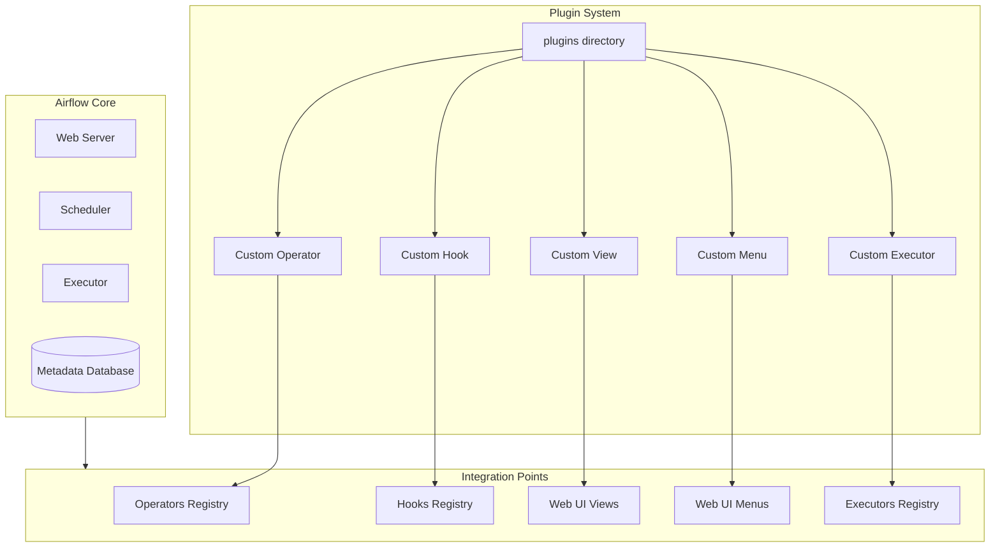

# Plugins

# Apache Airflow Plugins: Complete Professional Guide

## Overview of Airflow Plugins System

Apache Airflow's plugin system allows users to extend the core functionality by creating custom components. Plugins provide a mechanism to add new features, integrate with external systems, and customize Airflow's behavior without modifying the core codebase.

## Plugin Architecture



## Core Plugin Components

### 1. Plugin Base Class
```python
from airflow.plugins_manager import AirflowPlugin

class MyCustomPlugin(AirflowPlugin):
    name = "my_custom_plugin"
    operators = []
    sensors = []
    hooks = []
    executors = []
    macros = []
    admin_views = []
    flask_blueprints = []
    menu_links = []
    appbuilder_views = []
    appbuilder_menu_items = []
```

### 2. Directory Structure
```
airflow/
├── dags/
├── plugins/
│   ├── __init__.py
│   ├── operators/
│   │   ├── __init__.py
│   │   └── my_operator.py
│   ├── hooks/
│   │   ├── __init__.py
│   │   └── my_hook.py
│   ├── sensors/
│   │   ├── __init__.py
│   │   └── my_sensor.py
│   ├── macros/
│   │   └── my_macros.py
│   └── web/
│       ├── views.py
│       └── menu_links.py
└── config/
    └── airflow.cfg
```

## Plugin Types and Implementation

### 1. Custom Operators
```python
# plugins/operators/my_operator.py
from airflow.models import BaseOperator
from airflow.utils.decorators import apply_defaults
from airflow.providers.http.hooks.http import HttpHook

class CustomAPIOperator(BaseOperator):
    """
    Custom operator for calling a specific API endpoint
    """
    template_fields = ('endpoint', 'payload')
    ui_color = '#FFE4E1'
    ui_fgcolor = '#000000'

    @apply_defaults
    def __init__(self,
                 endpoint: str,
                 method: str = 'GET',
                 payload: dict = None,
                 response_handler: callable = None,
                 *args, **kwargs):
        super().__init__(*args, **kwargs)
        self.endpoint = endpoint
        self.method = method
        self.payload = payload
        self.response_handler = response_handler

    def execute(self, context):
        self.log.info(f"Calling API endpoint: {self.endpoint}")
        
        hook = HttpHook(method=self.method, http_conn_id='my_api_connection')
        response = hook.run(self.endpoint, json=self.payload)
        
        if response.status_code != 200:
            raise Exception(f"API call failed: {response.text}")
        
        result = response.json()
        
        if self.response_handler:
            result = self.response_handler(result)
        
        # Push result to XCom for other tasks
        context['ti'].xcom_push(key='api_response', value=result)
        
        return result
```

### 2. Custom Hooks
```python
# plugins/hooks/my_hook.py
from airflow.hooks.base import BaseHook
from requests.auth import HTTPBasicAuth
import requests

class CustomServiceHook(BaseHook):
    """
    Custom hook for interacting with MyCustomService API
    """
    def __init__(self, conn_id: str = 'my_custom_service_default'):
        super().__init__()
        self.conn_id = conn_id
        self.connection = self.get_connection(conn_id)

    def get_conn(self):
        """
        Returns authenticated session
        """
        conn = self.get_connection(self.conn_id)
        
        auth = HTTPBasicAuth(conn.login, conn.password)
        session = requests.Session()
        session.auth = auth
        session.headers.update({
            'Content-Type': 'application/json',
            'User-Agent': 'Airflow/MyCustomServiceHook'
        })
        
        return session

    def make_request(self, endpoint: str, method: str = 'GET', **kwargs):
        """
        Make API request to custom service
        """
        conn = self.get_connection(self.conn_id)
        base_url = conn.host or 'https://api.customservice.com'
        url = f"{base_url.rstrip('/')}/{endpoint.lstrip('/')}"
        
        session = self.get_conn()
        response = session.request(method=method, url=url, **kwargs)
        
        response.raise_for_status()
        return response.json()

    def get_data(self, resource_id: str):
        """
        Get specific resource data
        """
        return self.make_request(f"/api/v1/resources/{resource_id}")

    def create_data(self, data: dict):
        """
        Create new resource
        """
        return self.make_request("/api/v1/resources", method="POST", json=data)
```

### 3. Custom Sensors
```python
# plugins/sensors/my_sensor.py
from airflow.sensors.base import BaseSensorOperator
from airflow.utils.decorators import apply_defaults
from plugins.hooks.my_hook import CustomServiceHook

class CustomServiceSensor(BaseSensorOperator):
    """
    Sensor that waits for a specific condition in CustomService
    """
    template_fields = ('resource_id', 'expected_status')

    @apply_defaults
    def __init__(self,
                 resource_id: str,
                 expected_status: str = 'completed',
                 check_interval: int = 300,
                 *args, **kwargs):
        super().__init__(*args, **kwargs)
        self.resource_id = resource_id
        self.expected_status = expected_status
        self.check_interval = check_interval

    def poke(self, context):
        self.log.info(f"Checking status of resource {self.resource_id}")
        
        hook = CustomServiceHook()
        resource_data = hook.get_data(self.resource_id)
        
        current_status = resource_data.get('status')
        self.log.info(f"Current status: {current_status}, Expected: {self.expected_status}")
        
        return current_status == self.expected_status
```

### 4. Custom Macros
```python
# plugins/macros/my_macros.py
from datetime import datetime, timedelta
import json

def format_json_for_api(data_dict):
    """
    Format dictionary as JSON string for API requests
    """
    return json.dumps(data_dict, indent=2, default=str)

def calculate_business_days(start_date, days_to_add):
    """
    Calculate date adding only business days
    """
    current_date = start_date
    business_days_added = 0
    
    while business_days_added < days_to_add:
        current_date += timedelta(days=1)
        # Skip weekends (0=Monday, 6=Sunday)
        if current_date.weekday() < 5:
            business_days_added += 1
    
    return current_date

def generate_date_ranges(start_date, end_date, interval_days=7):
    """
    Generate date ranges for partitioning
    """
    current = start_date
    ranges = []
    
    while current < end_date:
        range_end = min(current + timedelta(days=interval_days), end_date)
        ranges.append((current, range_end))
        current = range_end
    
    return ranges
```

### 5. Web UI Plugins

#### Custom Views
```python
# plugins/web/views.py
from airflow.plugins_manager import AirflowPlugin
from flask import Blueprint, render_template
from flask_appbuilder import BaseView, expose

class CustomDashboardView(BaseView):
    route_base = "/custom_dashboard"

    @expose('/')
    def list(self):
        """
        Main dashboard view
        """
        return self.render_template(
            'custom_dashboard.html',
            title="Custom Dashboard",
            content="Welcome to the custom dashboard"
        )

    @expose('/stats')
    def stats(self):
        """
        Statistics view
        """
        # Add your custom logic here
        stats_data = {
            'total_tasks': 150,
            'running_tasks': 23,
            'completed_today': 45
        }
        return self.render_template(
            'custom_stats.html',
            title="Statistics",
            stats=stats_data
        )

# Blueprint for traditional Flask views
custom_blueprint = Blueprint(
    "custom_blueprint",
    __name__,
    template_folder="templates",
    static_folder="static",
    static_url_path="/static/custom"
)

@custom_blueprint.route('/custom_api/health')
def health_check():
    return {'status': 'healthy', 'timestamp': datetime.now().isoformat()}
```

#### Custom Menu Items
```python
# plugins/web/menu_links.py
from airflow.plugins_manager import AirflowPlugin
from flask_appbuilder import MenuItem, MenuView

class CustomMenuView(MenuView):
    route_base = "/custom_menu"

custom_menu_items = [
    MenuItem(
        "Custom Dashboard",
        href="/custom_dashboard",
        category="Custom",
        category_icon="fa-cog"
    ),
    MenuItem(
        "Statistics",
        href="/custom_dashboard/stats",
        category="Custom"
    ),
    MenuItem(
        "External Documentation",
        href="https://docs.example.com",
        category="Resources",
        category_icon="fa-book"
    )
]
```

## Complete Plugin Implementation

### Main Plugin Registration
```python
# plugins/__init__.py
from airflow.plugins_manager import AirflowPlugin

from plugins.operators.my_operator import CustomAPIOperator
from plugins.hooks.my_hook import CustomServiceHook
from plugins.sensors.my_sensor import CustomServiceSensor
from plugins.macros.my_macros import format_json_for_api, calculate_business_days, generate_date_ranges
from plugins.web.views import CustomDashboardView, custom_blueprint
from plugins.web.menu_links import custom_menu_items

class MyCustomPlugin(AirflowPlugin):
    name = "my_custom_plugin"
    description = "Custom plugin for MyCustomService integration"
    
    # Core components
    operators = [CustomAPIOperator]
    hooks = [CustomServiceHook]
    sensors = [CustomServiceSensor]
    macros = [format_json_for_api, calculate_business_days, generate_date_ranges]
    
    # Web UI components
    flask_blueprints = [custom_blueprint]
    appbuilder_views = [{
        "name": "Custom Dashboard",
        "category": "Custom",
        "view": CustomDashboardView()
    }]
    appbuilder_menu_items = custom_menu_items
    
    # Executors (advanced)
    executors = []
```

## Advanced Plugin Features

### 1. Custom Executors
```python
# plugins/executors/my_executor.py
from airflow.executors.base_executor import BaseExecutor
from airflow.utils.state import State
import threading
import queue

class CustomThreadPoolExecutor(BaseExecutor):
    """
    Custom executor using thread pool
    """
    def __init__(self, max_workers=10):
        super().__init__()
        self.max_workers = max_workers
        self.task_queue = queue.Queue()
        self.workers = []

    def start(self):
        """Start the executor"""
        self.workers = [
            threading.Thread(target=self._worker)
            for _ in range(self.max_workers)
        ]
        for worker in self.workers:
            worker.daemon = True
            worker.start()

    def _worker(self):
        """Worker thread function"""
        while True:
            try:
                key, command = self.task_queue.get()
                try:
                    self.execute_async(key, command)
                finally:
                    self.task_queue.task_done()
            except Exception as e:
                self.log.error(f"Worker error: {e}")

    def execute_async(self, key, command):
        """Execute command asynchronously"""
        try:
            # Your custom execution logic here
            self.log.info(f"Executing command: {command}")
            # Simulate execution
            self.change_state(key, State.SUCCESS)
        except Exception as e:
            self.change_state(key, State.FAILED)
            self.log.error(f"Execution failed: {e}")

    def queue_command(self, key, command):
        """Queue command for execution"""
        self.task_queue.put((key, command))
        return True

    def end(self):
        """End the executor"""
        self.task_queue.join()
        for worker in self.workers:
            worker.join(timeout=5)
```

### 2. Dynamic Plugin Loading
```python
# plugins/dynamic_loader.py
import importlib
import pkgutil
from pathlib import Path

def load_plugins_dynamically(plugins_directory: str):
    """
    Dynamically load all Python modules from plugins directory
    """
    plugins_path = Path(plugins_directory)
    
    for _, module_name, _ in pkgutil.iter_modules([str(plugins_path)]):
        try:
            module = importlib.import_module(f"plugins.{module_name}")
            if hasattr(module, 'plugin_class'):
                yield module.plugin_class
        except ImportError as e:
            print(f"Failed to import plugin {module_name}: {e}")
```

### 3. Plugin Configuration Management
```python
# plugins/config_manager.py
from airflow.configuration import conf
import os

class PluginConfigManager:
    """
    Manage plugin-specific configuration
    """
    def __init__(self, plugin_name: str):
        self.plugin_name = plugin_name
        self.config_section = f'plugin:{plugin_name}'

    def get(self, key: str, default=None):
        """Get configuration value"""
        try:
            return conf.get(self.config_section, key, fallback=default)
        except:
            return os.environ.get(f'AIRFLOW_PLUGIN_{self.plugin_name.upper()}_{key.upper()}', default)

    def get_int(self, key: str, default=0):
        """Get integer configuration value"""
        value = self.get(key, default)
        return int(value) if value else default

    def get_bool(self, key: str, default=False):
        """Get boolean configuration value"""
        value = self.get(key, default)
        if isinstance(value, bool):
            return value
        return value.lower() in ('true', 'yes', '1', 'on')
```

## Testing Plugins

### Unit Tests for Custom Operator
```python
# tests/test_my_operator.py
import unittest
from unittest.mock import patch, MagicMock
from plugins.operators.my_operator import CustomAPIOperator

class TestCustomAPIOperator(unittest.TestCase):

    @patch('plugins.operators.my_operator.HttpHook')
    def test_execute_success(self, mock_http_hook):
        # Mock the HTTP hook
        mock_hook_instance = MagicMock()
        mock_response = MagicMock()
        mock_response.status_code = 200
        mock_response.json.return_value = {'result': 'success'}
        mock_hook_instance.run.return_value = mock_response
        mock_http_hook.return_value = mock_hook_instance

        # Create and test operator
        operator = CustomAPIOperator(
            task_id='test_task',
            endpoint='/test'
        )

        result = operator.execute({})

        self.assertEqual(result, {'result': 'success'})
        mock_hook_instance.run.assert_called_once_with('/test')

    @patch('plugins.operators.my_operator.HttpHook')
    def test_execute_failure(self, mock_http_hook):
        mock_hook_instance = MagicMock()
        mock_response = MagicMock()
        mock_response.status_code = 404
        mock_response.text = 'Not found'
        mock_hook_instance.run.return_value = mock_response
        mock_http_hook.return_value = mock_hook_instance

        operator = CustomAPIOperator(
            task_id='test_task',
            endpoint='/test'
        )

        with self.assertRaises(Exception) as context:
            operator.execute({})

        self.assertIn('API call failed', str(context.exception))
```

### Integration Tests
```python
# tests/integration/test_plugin_integration.py
import pytest
from airflow import settings
from airflow.models import DagBag

class TestPluginIntegration:

    @pytest.fixture(autouse=True)
    def setup(self):
        self.dagbag = DagBag(include_examples=False)

    def test_plugin_loading(self):
        """Test that plugins are loaded correctly"""
        assert 'my_custom_plugin' in settings.plugins
        assert hasattr(settings.plugins['my_custom_plugin'], 'operators')
        assert len(settings.plugins['my_custom_plugin'].operators) > 0

    def test_custom_operator_available(self):
        """Test that custom operator is available in DAG parsing"""
        dag = self.dagbag.get_dag('test_custom_operator')
        assert dag is not None
        
        task = dag.get_task('custom_api_task')
        assert task is not None
        assert task.__class__.__name__ == 'CustomAPIOperator'
```

## Best Practices for Plugin Development

### 1. Code Organization
```python
# Recommended structure
"""
plugins/
├── __init__.py
├── operators/
│   ├── __init__.py
│   ├── base_operator.py
│   └── specialized_operator.py
├── hooks/
│   ├── __init__.py
│   └── api_hook.py
├── sensors/
│   ├── __init__.py
│   └── api_sensor.py
├── macros/
│   └── custom_macros.py
├── web/
│   ├── templates/
│   │   └── custom_dashboard.html
│   ├── static/
│   │   └── css/
│   │       └── custom.css
│   ├── views.py
│   └── menu_links.py
└── utils/
    ├── __init__.py
    └── helpers.py
"""
```

### 2. Error Handling and Logging
```python
class RobustCustomOperator(BaseOperator):
    def execute(self, context):
        try:
            self.log.info("Starting execution")
            # Main logic
            result = self._perform_operation()
            self.log.info("Operation completed successfully")
            return result
            
        except TransientError as e:
            self.log.warning(f"Transient error occurred: {e}")
            raise AirflowException(f"Operation failed temporarily: {e}")
            
        except PermanentError as e:
            self.log.error(f"Permanent error occurred: {e}")
            raise AirflowException(f"Operation failed permanently: {e}")
            
        except Exception as e:
            self.log.exception("Unexpected error occurred")
            raise AirflowException(f"Unexpected error: {e}")

    def _perform_operation(self):
        # Implementation with retry logic
        for attempt in range(3):
            try:
                return self._call_external_service()
            except TemporaryError as e:
                if attempt == 2:
                    raise
                self.log.info(f"Retry attempt {attempt + 1}")
                time.sleep(2 ** attempt)
```

### 3. Configuration Management
```python
# Use Airflow's configuration system
from airflow.configuration import conf

class ConfigurableOperator(BaseOperator):
    @apply_defaults
    def __init__(self, 
                 custom_param: str = None,
                 *args, **kwargs):
        super().__init__(*args, **kwargs)
        
        # Get configuration from airflow.cfg or environment
        self.default_timeout = conf.getint('my_plugin', 'default_timeout', fallback=300)
        self.max_retries = conf.getint('my_plugin', 'max_retries', fallback=3)
        
        # Use provided parameter or default from configuration
        self.custom_param = custom_param or conf.get('my_plugin', 'custom_param', fallback='default')
```

### 4. Version Compatibility
```python
# Handle different Airflow versions
import airflow
from packaging import version

AF_VERSION = version.parse(airflow.__version__)

if AF_VERSION >= version.parse("2.0.0"):
    # Use new API
    from airflow.providers.common.sql.operators.sql import SQLExecuteQueryOperator
else:
    # Fallback for older versions
    from airflow.operators.sql import SQLExecuteQueryOperator

class VersionAwareOperator(BaseOperator):
    def __init__(self, *args, **kwargs):
        if AF_VERSION >= version.parse("2.3.0"):
            # New feature available
            self.use_new_feature = True
        else:
            self.use_new_feature = False
        super().__init__(*args, **kwargs)
```

## Deployment and Distribution

### 1. Packaging Plugins
```python
# setup.py for plugin distribution
from setuptools import setup, find_packages

setup(
    name="airflow-my-custom-plugin",
    version="1.0.0",
    packages=find_packages(),
    install_requires=[
        'apache-airflow>=2.0.0',
        'requests>=2.25.0',
        'python-dateutil>=2.8.0',
    ],
    entry_points={
        'airflow.plugins': [
            'my_custom_plugin = plugins:MyCustomPlugin'
        ]
    },
    author="Your Name",
    author_email="your.email@example.com",
    description="Custom Airflow plugin for MyCustomService integration",
    long_description=open('README.md').read(),
    long_description_content_type="text/markdown",
    classifiers=[
        "Development Status :: 5 - Production/Stable",
        "Environment :: Web Environment",
        "Intended Audience :: Developers",
        "License :: OSI Approved :: Apache Software License",
        "Programming Language :: Python :: 3.8",
        "Programming Language :: Python :: 3.9",
        "Programming Language :: Python :: 3.10",
    ],
)
```

### 2. Installation
```bash
# Install from source
pip install -e .

# Install from package repository
pip install airflow-my-custom-plugin

# Or include in requirements.txt
echo "airflow-my-custom-plugin==1.0.0" >> requirements.txt
```

### 3. Configuration
```ini
# airflow.cfg
[my_plugin]
default_timeout = 600
max_retries = 5
custom_param = production_value

# Environment variables
export AIRFLOW__MY_PLUGIN__DEFAULT_TIMEOUT=600
export AIRFLOW__MY_PLUGIN__MAX_RETRIES=5
```

 
