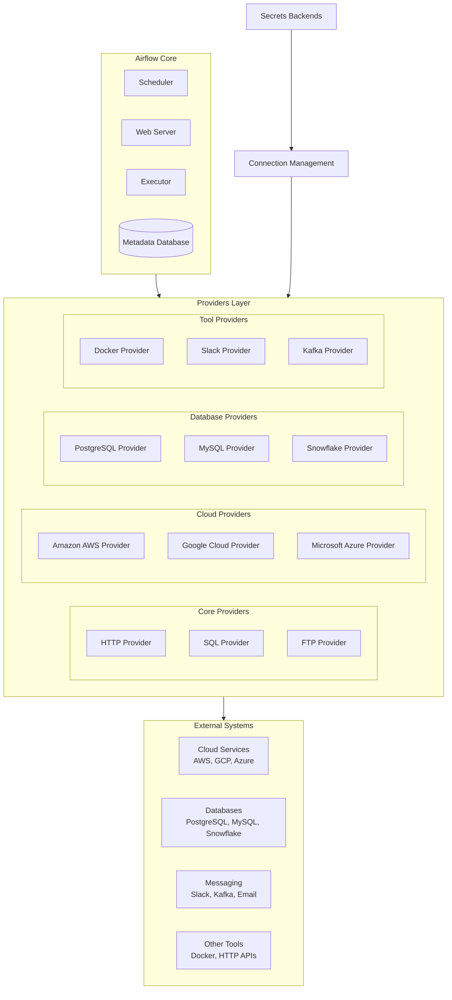

# Providers

# Apache Airflow Providers: Complete Professional Guide

## Overview of Apache Airflow Providers System

Apache Airflow Providers are modular packages that extend Airflow's functionality to integrate with external systems. They represent a fundamental shift from the monolithic architecture of Airflow 1.x to the modular, extensible architecture of Airflow 2.0+.

## Provider Architecture



## Core Provider Concepts

### 1. Provider Package Structure
```
apache-airflow-providers-<provider>/
├── setup.py
├── airflow/
│   └── providers/
│       └── <provider>/
│           ├── __init__.py
│           ├── hooks/
│           │   ├── __init__.py
│           │   └── <service>_hook.py
│           ├── operators/
│           │   ├── __init__.py
│           │   └── <service>_operator.py
│           ├── sensors/
│           │   ├── __init__.py
│           │   └── <service>_sensor.py
│           ├── transfers/
│           │   ├── __init__.py
│           │   └── <source>_to_<destination>_operator.py
│           └── example_dags/
│               └── example_<service>_dag.py
```

### 2. Provider Metadata
Each provider includes metadata in `provider.yaml`:
```yaml
apiVersion: 1.0
name: Amazon
description: Provider for Amazon Web Services.
versions:
  - 1.0.0
  - 2.0.0
dependencies:
  - apache-airflow>=2.3.0
  - boto3>=1.12.0
  - watchtower>=0.7.0
integrations:
  - integration-name: Amazon S3
    python-module: airflow.providers.amazon.aws.hooks.s3
    how-to-guide: /howto/operator/s3.html
  - integration-name: AWS Lambda
    python-module: airflow.providers.amazon.aws.operators.lambda_function
    how-to-guide: /howto/operator/lambda.html
```

## Provider Types and Categories

### 1. Core Providers
```python
# Built-in essential providers
pip install apache-airflow-providers-http
pip install apache-airflow-providers-ftp
pip install apache-airflow-providers-sqlite
pip install apache-airflow-providers-imap
```

### 2. Cloud Providers
```python
# Major cloud platforms
pip install apache-airflow-providers-amazon
pip install apache-airflow-providers-google
pip install apache-airflow-providers-microsoft-azure
pip install apache-airflow-providers-cncf-kubernetes
```

### 3. Database Providers
```python
# Database integrations
pip install apache-airflow-providers-postgres
pip install apache-airflow-providers-mysql
pip install apache-airflow-providers-snowflake
pip install apache-airflow-providers-mongo
pip install apache-airflow-providers-oracle
pip install apache-airflow-providers-redis
```

### 4. Messaging & Notification Providers
```python
# Communication providers
pip install apache-airflow-providers-slack
pip install apache-airflow-providers-telegram
pip install apache-airflow-providers-microsoft-teams
pip install apache-airflow-providers-email
```

### 5. Specialized Tool Providers
```python
# Specialized integrations
pip install apache-airflow-providers-docker
pip install apache-airflow-providers-apache-spark
pip install apache-airflow-providers-apache-kafka
pip install apache-airflow-providers-apache-hive
pip install apache-airflow-providers-elasticsearch
```

## Provider Components Deep Dive

### 1. Hooks
```python
from airflow.providers.amazon.aws.hooks.s3 import S3Hook
from airflow.providers.snowflake.hooks.snowflake import SnowflakeHook
from airflow.providers.google.cloud.hooks.bigquery import BigQueryHook

# Example: S3 Hook usage
s3_hook = S3Hook(aws_conn_id='aws_default')
s3_hook.list_keys(bucket_name='my-bucket', prefix='data/')

# Example: Snowflake Hook
snowflake_hook = SnowflakeHook(snowflake_conn_id='snowflake_conn')
result = snowflake_hook.run("SELECT * FROM my_table")
```

### 2. Operators
```python
from airflow.providers.amazon.aws.operators.s3 import S3CopyObjectOperator
from airflow.providers.google.cloud.operators.bigquery import BigQueryExecuteQueryOperator
from airflow.providers.snowflake.operators.snowflake import SnowflakeOperator

# Example: BigQuery Operator
bq_operator = BigQueryExecuteQueryOperator(
    task_id='bq_query',
    sql='SELECT * FROM `project.dataset.table`',
    destination_dataset_table='project.dataset.results',
    write_disposition='WRITE_TRUNCATE',
    gcp_conn_id='google_cloud_default'
)

# Example: S3 Copy Operator
s3_copy = S3CopyObjectOperator(
    task_id='s3_copy',
    source_bucket_key='source-bucket/path/to/file',
    dest_bucket_key='dest-bucket/path/to/file',
    aws_conn_id='aws_default'
)
```

### 3. Sensors
```python
from airflow.providers.amazon.aws.sensors.s3 import S3KeySensor
from airflow.providers.google.cloud.sensors.gcs import GCSObjectExistenceSensor
from airflow.providers.http.sensors.http import HttpSensor

# Example: S3 Key Sensor
s3_sensor = S3KeySensor(
    task_id='s3_file_sensor',
    bucket_key='s3://my-bucket/data/file.csv',
    aws_conn_id='aws_default',
    timeout=300,
    poke_interval=30
)

# Example: HTTP Sensor
http_sensor = HttpSensor(
    task_id='api_health_check',
    http_conn_id='http_default',
    endpoint='api/health',
    response_check=lambda response: response.status_code == 200
)
```

### 4. Transfers
```python
from airflow.providers.amazon.aws.transfers.s3_to_redshift import S3ToRedshiftOperator
from airflow.providers.google.cloud.transfers.gcs_to_bigquery import GCSToBigQueryOperator
from airflow.providers.microsoft.azure.transfers.local_to_wasb import LocalFilesystemToWasbOperator

# Example: S3 to Redshift Transfer
s3_to_redshift = S3ToRedshiftOperator(
    task_id='s3_to_redshift',
    schema='public',
    table='my_table',
    s3_bucket='my-bucket',
    s3_key='data/file.csv',
    copy_options=['CSV', 'IGNOREHEADER 1'],
    aws_conn_id='aws_default',
    redshift_conn_id='redshift_default'
)

# Example: GCS to BigQuery Transfer
gcs_to_bq = GCSToBigQueryOperator(
    task_id='gcs_to_bq',
    bucket='my-bucket',
    source_objects=['data/*.csv'],
    destination_project_dataset_table='project.dataset.table',
    source_format='CSV',
    write_disposition='WRITE_TRUNCATE',
    gcp_conn_id='google_cloud_default'
)
```

## Provider Management

### 1. Installation and Version Management
```bash
# Install specific provider version
pip install apache-airflow-providers-amazon==8.0.0

# Install with extra dependencies
pip install apache-airflow-providers-google[bigquery,gcs]

# Upgrade providers
pip install --upgrade apache-airflow-providers-amazon

# List installed providers
airflow providers list

# Get provider details
airflow providers info apache-airflow-providers-amazon
```

### 2. Provider Configuration
```python
# airflow.cfg configuration for providers
[providers]
# Auto-install providers from requirements
auto_install_providers = True

# Provider-specific configuration
[amazon]
default_region = us-west-2
max_retries = 5

[google]
project_id = my-gcp-project
location = us-central1

[snowflake]
default_warehouse = COMPUTE_WH
default_database = PRODUCTION_DB
```

### 3. Connection Management
```bash
# Add connections via CLI
airflow connections add aws_default \
    --conn-type aws \
    --conn-login AWS_ACCESS_KEY_ID \
    --conn-password AWS_SECRET_ACCESS_KEY \
    --conn-extra '{"region_name": "us-west-2"}'

airflow connections add snowflake_conn \
    --conn-type snowflake \
    --conn-host my-account.snowflakecomputing.com \
    --conn-login my_username \
    --conn-password my_password \
    --conn-extra '{"account": "my-account", "warehouse": "my-warehouse", "database": "my-database", "schema": "my-schema"}'
```

## Advanced Provider Usage

### 1. Custom Providers Development
```python
# setup.py for custom provider
from setuptools import setup, find_namespace_packages

setup(
    name="apache-airflow-providers-mycompany",
    version="1.0.0",
    packages=find_namespace_packages(include=['airflow.providers.mycompany']),
    install_requires=[
        'apache-airflow>=2.3.0',
        'mycompany-sdk>=1.2.0',
    ],
    entry_points={
        "apache_airflow_provider": [
            "provider_info=airflow.providers.mycompany.__init__:get_provider_info"
        ]
    },
    provider_info={
        'package-name': 'apache-airflow-providers-mycompany',
        'name': 'MyCompany',
        'description': 'Provider for MyCompany services integration.',
        'versions': ['1.0.0'],
        'integrations': [
            {
                'integration-name': 'MyCompany Service',
                'external-doc-url': 'https://docs.mycompany.com',
                'how-to-guide': 'https://docs.mycompany.com/airflow',
                'python-modules': ['airflow.providers.mycompany.operators.myservice'],
            }
        ],
    },
)
```

### 2. Provider Information Module
```python
# airflow/providers/mycompany/__init__.py
def get_provider_info():
    return {
        "package-name": "apache-airflow-providers-mycompany",
        "name": "MyCompany",
        "description": "Provider for MyCompany services integration.",
        "versions": ["1.0.0"],
        "integrations": [
            {
                "integration-name": "MyCompany Service",
                "external-doc-url": "https://docs.mycompany.com",
                "how-to-guide": "https://docs.mycompany.com/airflow",
                "python-modules": ["airflow.providers.mycompany.operators.myservice"],
            }
        ],
    }
```

### 3. Custom Operator Implementation
```python
# airflow/providers/mycompany/operators/myservice.py
from airflow.models import BaseOperator
from airflow.providers.mycompany.hooks.myservice import MyServiceHook
from airflow.utils.decorators import apply_defaults

class MyServiceOperator(BaseOperator):
    template_fields = ('command', 'parameters')
    ui_color = '#FFE4E1'

    @apply_defaults
    def __init__(
        self,
        command: str,
        parameters: dict = None,
        mycompany_conn_id: str = 'mycompany_default',
        *args, **kwargs
    ):
        super().__init__(*args, **kwargs)
        self.command = command
        self.parameters = parameters or {}
        self.mycompany_conn_id = mycompany_conn_id

    def execute(self, context):
        hook = MyServiceHook(mycompany_conn_id=self.mycompany_conn_id)
        result = hook.execute_command(self.command, self.parameters)
        
        context['ti'].xcom_push(key='mycompany_result', value=result)
        return result
```

## Provider Best Practices

### 1. Version Compatibility Management
```python
# Check provider compatibility
from airflow import __version__ as airflow_version
from packaging import version

def check_provider_compatibility(provider_name, provider_version):
    # Define compatibility matrix
    compatibility_matrix = {
        'apache-airflow-providers-amazon': {
            '8.0.0': '>=2.3.0,<2.6.0',
            '7.0.0': '>=2.2.0,<2.5.0',
        },
        'apache-airflow-providers-google': {
            '10.0.0': '>=2.4.0,<2.7.0',
            '9.0.0': '>=2.3.0,<2.6.0',
        }
    }
    
    if provider_name in compatibility_matrix:
        if provider_version in compatibility_matrix[provider_name]:
            required_airflow = compatibility_matrix[provider_name][provider_version]
            if version.parse(airflow_version) not in version.parse(required_airflow):
                raise ValueError(f"Provider {provider_name} {provider_version} "
                               f"requires Airflow {required_airflow}, "
                               f"but you have {airflow_version}")
```

### 2. Connection Management Best Practices
```python
# Secure connection handling
from airflow.models import Connection
from airflow.secrets import BaseSecretsBackend
from cryptography.fernet import Fernet

class EncryptedSecretsBackend(BaseSecretsBackend):
    def __init__(self, encryption_key):
        self.cipher = Fernet(encryption_key)

    def get_connection(self, conn_id):
        # Get encrypted connection from storage
        encrypted_data = self._get_encrypted_connection(conn_id)
        if encrypted_data:
            decrypted_data = self.cipher.decrypt(encrypted_data)
            return Connection.from_json(decrypted_data.decode())
        return None

# Usage
encryption_key = Fernet.generate_key()
secrets_backend = EncryptedSecretsBackend(encryption_key)
```

### 3. Error Handling and Retry Logic
```python
# Robust provider usage with retries
from tenacity import retry, stop_after_attempt, wait_exponential, retry_if_exception_type
from airflow.exceptions import AirflowException

class RobustProviderOperator(BaseOperator):
    @retry(
        stop=stop_after_attempt(3),
        wait=wait_exponential(multiplier=1, min=4, max=10),
        retry=retry_if_exception_type((TimeoutError, ConnectionError)),
        reraise=True
    )
    def execute_with_retry(self, context):
        try:
            hook = self.get_hook()
            result = hook.execute_operation(self.parameters)
            return result
        except (TimeoutError, ConnectionError) as e:
            self.log.warning(f"Temporary error: {e}, retrying...")
            raise
        except Exception as e:
            self.log.error(f"Permanent error: {e}")
            raise AirflowException(f"Operation failed: {e}")

    def execute(self, context):
        return self.execute_with_retry(context)
```

## Provider Testing Strategies

### 1. Unit Testing Providers
```python
# tests/test_myprovider_operator.py
import unittest
from unittest.mock import patch, MagicMock
from airflow.providers.mycompany.operators.myservice import MyServiceOperator

class TestMyServiceOperator(unittest.TestCase):

    @patch('airflow.providers.mycompany.operators.myservice.MyServiceHook')
    def test_execute_success(self, mock_hook_class):
        # Setup mock
        mock_hook = MagicMock()
        mock_hook.execute_command.return_value = {'status': 'success'}
        mock_hook_class.return_value = mock_hook

        # Test operator
        operator = MyServiceOperator(
            task_id='test_task',
            command='process_data',
            parameters={'input': 'test.csv'}
        )

        result = operator.execute({})

        self.assertEqual(result, {'status': 'success'})
        mock_hook.execute_command.assert_called_once_with(
            'process_data', {'input': 'test.csv'}
        )

    @patch('airflow.providers.mycompany.operators.myservice.MyServiceHook')
    def test_execute_failure(self, mock_hook_class):
        mock_hook = MagicMock()
        mock_hook.execute_command.side_effect = Exception('Service unavailable')
        mock_hook_class.return_value = mock_hook

        operator = MyServiceOperator(
            task_id='test_task',
            command='process_data'
        )

        with self.assertRaises(Exception):
            operator.execute({})
```

### 2. Integration Testing
```python
# tests/integration/test_provider_integration.py
import pytest
from airflow import settings
from airflow.models import Connection
from airflow.providers.mycompany.hooks.myservice import MyServiceHook

@pytest.mark.integration
class TestMyServiceIntegration:

    @pytest.fixture(autouse=True)
    def setup(self):
        # Setup test connection
        self.conn = Connection(
            conn_id='test_mycompany',
            conn_type='mycompany',
            host='test-api.mycompany.com',
            login='testuser',
            password='testpass',
            extra='{"environment": "test"}'
        )
        session = settings.Session()
        session.add(self.conn)
        session.commit()

    def test_hook_integration(self):
        hook = MyServiceHook(mycompany_conn_id='test_mycompany')
        
        # Test actual API call
        result = hook.execute_command('ping', {})
        
        assert result['status'] == 'ok'
        assert 'version' in result
```

## Provider Deployment and Monitoring

### 1. Deployment Strategies
```bash
# Using requirements.txt with version pins
apache-airflow==2.5.0
apache-airflow-providers-amazon==8.0.0
apache-airflow-providers-google==10.0.0
apache-airflow-providers-snowflake==4.0.0

# Using constraints file
pip install \
    apache-airflow==2.5.0 \
    apache-airflow-providers-amazon==8.0.0 \
    --constraint "https://raw.githubusercontent.com/apache/airflow/constraints-2.5.0/constraints-3.8.txt"
```

### 2. Monitoring Provider Health
```python
# Provider health check DAG
from airflow import DAG
from airflow.operators.python import PythonOperator
from airflow.providers.http.sensors.http import HttpSensor
from datetime import datetime, timedelta

def check_provider_health():
    providers_to_check = [
        'apache-airflow-providers-amazon',
        'apache-airflow-providers-google',
        'apache-airflow-providers-snowflake'
    ]
    
    healthy_providers = []
    unhealthy_providers = []
    
    for provider in providers_to_check:
        try:
            __import__(provider.replace('-', '_'))
            healthy_providers.append(provider)
        except ImportError:
            unhealthy_providers.append(provider)
    
    if unhealthy_providers:
        raise Exception(f"Unhealthy providers: {unhealthy_providers}")
    
    return f"Healthy providers: {healthy_providers}"

default_args = {
    'owner': 'airflow',
    'start_date': datetime(2023, 1, 1),
    'retries': 1,
    'retry_delay': timedelta(minutes=5),
}

with DAG(
    'provider_health_check',
    default_args=default_args,
    schedule_interval='@daily',
    catchup=False,
) as dag:

    health_check = PythonOperator(
        task_id='check_provider_health',
        python_callable=check_provider_health
    )
```

### 3. Provider Version Auditing
```bash
# Audit installed providers
airflow providers list --output json > provider_audit.json

# Check for outdated providers
pip list --outdated | grep apache-airflow-providers

# Security vulnerability scanning
pip install safety
safety check -r requirements.txt
```

## Provider Troubleshooting

### 1. Common Issues and Solutions
```python
# Debugging provider issues
import logging
from airflow.providers.amazon.aws.hooks.s3 import S3Hook

# Enable debug logging
logging.basicConfig(level=logging.DEBUG)

try:
    hook = S3Hook(aws_conn_id='aws_default')
    files = hook.list_keys('my-bucket')
    print(f"Found {len(files)} files")
except Exception as e:
    print(f"Error: {e}")
    # Check connection details
    from airflow.models import Connection
    conn = Connection.get_connection_from_secrets('aws_default')
    print(f"Connection details: {conn.__dict__}")
```

### 2. Provider Compatibility Matrix
```python
# Compatibility check utility
def check_provider_compatibility():
    compatibility = {
        'apache-airflow': '2.5.0',
        'apache-airflow-providers-amazon': '8.0.0',
        'apache-airflow-providers-google': '10.0.0',
        'apache-airflow-providers-snowflake': '4.0.0',
    }
    
    # Verify installed versions match compatibility matrix
    import pkg_resources
    for package, expected_version in compatibility.items():
        try:
            installed_version = pkg_resources.get_distribution(package).version
            if installed_version != expected_version:
                print(f"WARNING: {package} version {installed_version} "
                      f"does not match expected {expected_version}")
        except pkg_resources.DistributionNotFound:
            print(f"ERROR: {package} not installed")
```

