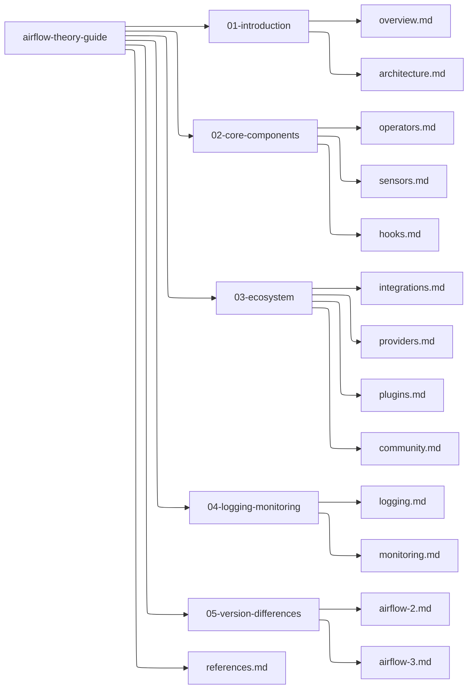

# Airflow Theory Guide

Welcome to the **Airflow Theory Guide**, a comprehensive educational repository for understanding Apache Airflow. This repository focuses on **conceptual knowledge** and **architecture insights**. Practical projects and hands-on ETL pipelines are handled in separate repositories.



## Repository Structure (Left-to-Right)

airflow-theory-guide 

​		      → 01-introduction → overview.md, architecture.md  
​                     → 02-core-components → operators.md, sensors.md, hooks.md  
​                     → 03-ecosystem → integrations.md, providers.md, plugins.md, community.md  
​                     → 04-logging-monitoring → logging.md, monitoring.md  
​                     → 05-version-differences → airflow-2.md, airflow-3.md  
​                     → references.md  

---

## Structure Details

### 01-introduction
**Files:** `overview.md`, `architecture.md`  
- **overview.md**: General introduction to Airflow, its purpose, and use cases in ETL and workflow orchestration.  
- **architecture.md**: Detailed explanation of Airflow architecture including Scheduler, Webserver, Metadata Database, and Executor concepts.

### 02-core-components
**Files:** `operators.md`, `sensors.md`, `hooks.md`  
- **operators.md**: Core building blocks of workflows, including PythonOperator, BashOperator, and custom operators.  
- **sensors.md**: Overview of sensors and how they are used to wait for certain conditions or external events.  
- **hooks.md**: Connectors to external systems such as databases, APIs, and cloud services.

### 03-ecosystem
**Files:** `integrations.md`, `providers.md`, `plugins.md`, `community.md`  
- **integrations.md**: How Airflow integrates with data warehouses, ETL tools, and orchestration systems.  
- **providers.md**: Explanation of provider packages (e.g., Google, AWS, Azure) and how they extend functionality.  
- **plugins.md**: Custom plugins, operators, sensors, hooks, and UI extensions.  
- **community.md**: Overview of Airflow community, forums, and contribution guidelines.

### 04-logging-monitoring
**Files:** `logging.md`, `monitoring.md`  
- **logging.md**: How Airflow logs task execution, DAG runs, and system events.  
- **monitoring.md**: Monitoring workflows using Airflow UI, alerts, and metrics with external tools like Prometheus and Grafana.

### 05-version-differences
**Files:** `airflow-2.md`, `airflow-3.md`  
- **airflow-2.md**: Key differences and improvements from Airflow 1.x to 2.x.  
- **airflow-3.md**: Expected updates and changes in Airflow 3.x (if available), focusing on architecture, scheduling, and API changes.

### references.md
- A curated list of books, articles, official documentation, and tutorials for deeper learning.

---

## Notes
- This repository **only covers theoretical knowledge**. Hands-on ETL projects using Airflow will be in separate repositories.  
- Airflow is part of a broader **data orchestration ecosystem**, connecting with tools like DBT, Apache Spark, Kafka, and more.  
- The repository is designed to **help beginners and intermediate users** understand Airflow’s core concepts before implementing real pipelines.

---

**Happy Learning!** 

```
airflow-theory-guide/
│
├── README.md                  # Main theoretical guide (already prepared)
│
├── 01-introduction/
│   ├── overview.md            # What is Airflow, why use it
│   └── architecture.md        # Scheduler, Executor, Web UI, CLI
│
├── 02-core-components/
│   ├── operators.md           # Operators explained
│   ├── sensors.md             # Sensors explained
│   └── hooks.md               # Hooks explained
│
├── 03-ecosystem/
│   ├── integrations.md        # Integrations with DB, cloud, messaging
│   ├── providers.md           # Airflow providers
│   ├── plugins.md             # Custom extensions
│   └── community.md           # Community and resources
│
├── 04-logging-monitoring/
│   ├── logging.md             # Task logs and debugging
│   └── monitoring.md          # Monitoring, alerting, Grafana/Prometheus
│
├── 05-version-differences/
│   ├── airflow-2.md           # Features and improvements in 2.x
│   └── airflow-3.md           # Upcoming changes in 3.x
│
└── references.md              # All links to official docs and tutorials
```

# 
